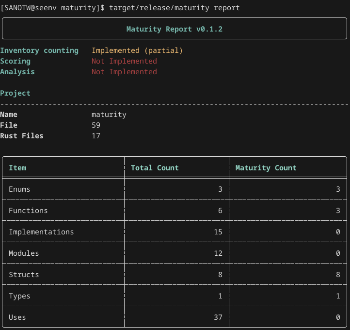

# maturity-cli

Standalone command-line interface for the `maturity` ecosystem.
Provides the `maturity` executable without relying on cargo plugin support.

It provides the standalone `maturity` executable for environments where invoking `cargo maturity` is unnecessary or inconvenient, including:

- CI pipelines
- automation scripts
- editor integrations
- external tooling
- custom workflows

## Current

Version `0.1.2` focuses on inventory reporting.
It currently reports:

- project file counts
- Rust file counts
- Rust item counts
- `#[maturity]` - annotated item counts

The only available command is `report`, which is also the default when no command or subcommand is provided.

## Installation

```shell
cargo install maturity-cli
```

## Screenshot


Maturity Report of the maturity workspace using the standalone `maturity` executable

## Commands

### `report`

> [!NOTE]
>  v0.1.2 - generates an inventory report for the current project or workspace



## Learn More

See the workspace README for an overview of the maturity ecosystem.

## Repository

Primary repository: [Codeberg](https://codeberg.org/SANOTW/maturity.git)

Mirror repository: [GitHub](https://github.com/SANOTW/maturity)

## MSRV

Minimum Supported Rust Version: 1.94.1

## License

Licensed under Apache-2.0. See the workspace LICENSE file for details.
